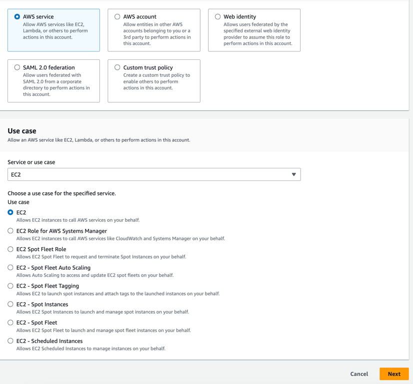
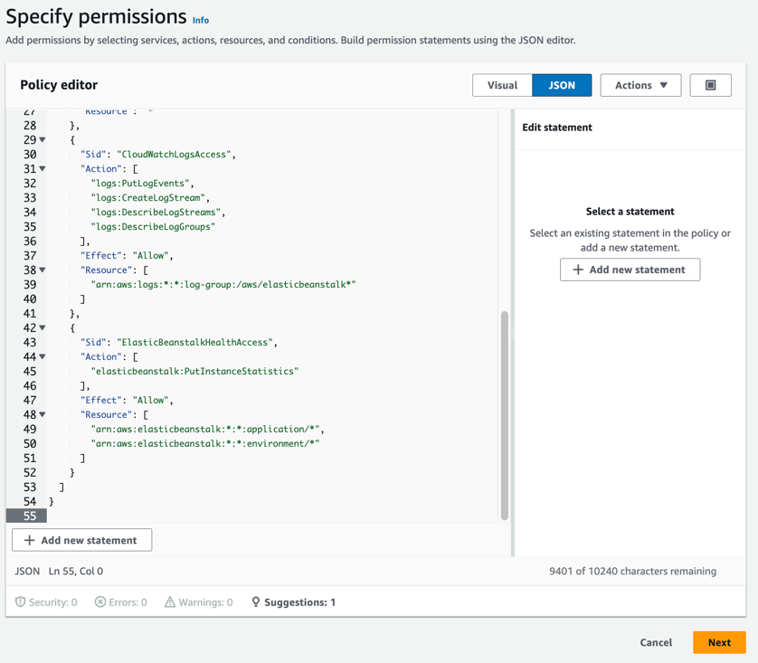
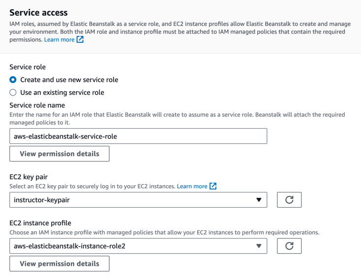
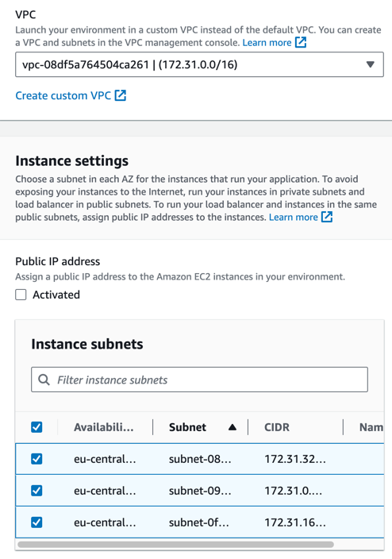
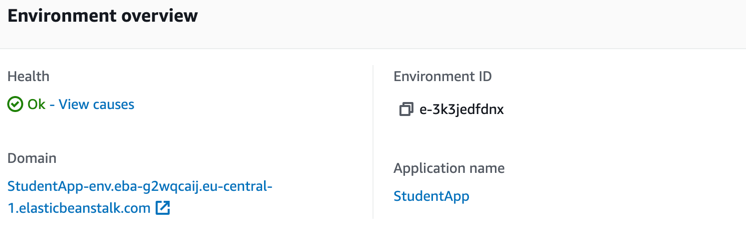
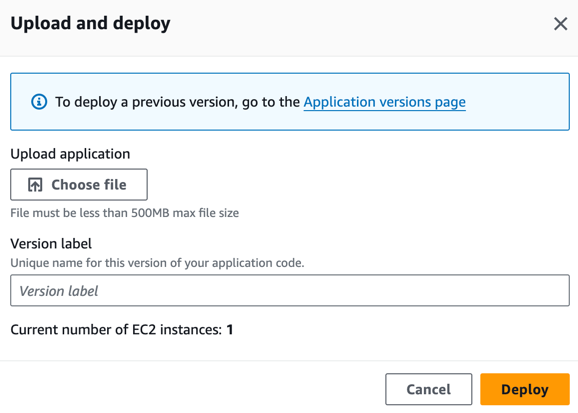

# Aufgabenstellung
Im Rahmen dieser Aufgabe erstellen wir eine einfache Elastic Beanstalk-Anwendung auf Basis von Python Flask.

## Instance Profile erstellen
- Melden Sie sich bei der AWS Management Console an und öffnen Sie die IAM-Übersicht.
- Klicken Sie im Menü links auf "Roles"
- Klicken Sie auf "Create Role"
- Wählen Sie als Trust Entity Type "AWS Service" und als Use Case "EC2" mit dem Use Case "EC2 - Allows EC2 instances to call AWS services on your behalf."

- Wählen Sie zunächst keine Permissions
- Wählen Sie als Namen "aws-elasticbeanstalk-instance-role" und schließen Sie den Wizard ab
- Klicken Sie nun auf die neu erstellte Rolle
- Klicken Sie in "Permission Policies" auf "Add Permissions - Create Inline Policy"
- Schalten Sie den Policy Editor in den "JSON"-Modus und kopieren Sie den Inhalt der Datei [policy.json](policy.json) in den Editor. 

- Vergeben Sie einen beliebigen Namen für die Policy
- Speichern Sie die Rolle.

## Neue Anwendung erstellen
- Öffnen Sie über die Suchleiste den Elastic Beanstalk Service.
- Klicken Sie auf "Create a new application".
- Wählen Sie "Web server environment" und vergeben Sie einen beliebigen Namen.
- Wählen Sie den Plattformtyp "managed" mit Typ "Python"
- Unter "Application Code", wählen Sie zunächst "Sample Application"
- Lassen Sie das Preset auf "Single Instance"

#### Service Access
- Wählen Sie für die Service Role "Create and use new service role" aus
- Wählen Sie ein EC2 Key Pair Ihres Accounts (wenn keines existiert, legen Sie eines an. Fragen Sie mich im Zweifel, wie das geht)
- Wählen Sie das Instance Profile, das sie oben erstellt haben

#### Networking
- Wählen Sie die Standard-VPC, die in Ihrem Account vorhanden ist
- Aktivieren sie alle drei Subnetze der VPC im nächsten Abschnitt
- Klicken Sie unten auf "Next". Sie können den Wizard nun bis zum Ende weiter abschließen und alle Defaults aktiv lassen

#### Test
- Warten Sie, bis die Einrichtung der Anwendung abgeschlossen ist. Der "Health"-Status sollte sich dann grün färben
- Öffnen Sie danach den "Domain"-Link. Er sollte die Beispielanwendung zeigen

## Eigene Beispielanwendung bereitstellen
Die Umgebung ist aktuell mit einer Beispielanwendung bestückt. Um zu zeigen, wie einfach es ist, in Elastic Beanstalk Änderungen zu deployen, installieren wir nun eine andere Python-Anwendung.
- Verwenden Sie den bereitgestellten Beispielcode in [python-app](python-app). Dort finden Sie eine fertige Zip-Datei mit einer einfachen Python-Flask-Anwendung. Sie können aber auch jede andere Python-Anwendung deployen, wenn Sie möchten.
- Klicken Sie auf "Upload & Deploy" und wählen Sie die Zip-Datei mit Ihrer Anwendung hoch (z.B. [diese Datei](python-app/flask-app.zip))
- Klicken Sie auf "Deploy"

- Warten Sie, bis das Deployment abgeschlossen ist. Im Anschluss können sie unter der Domain prüfen, ob die neue Anwendung deployt ist.

