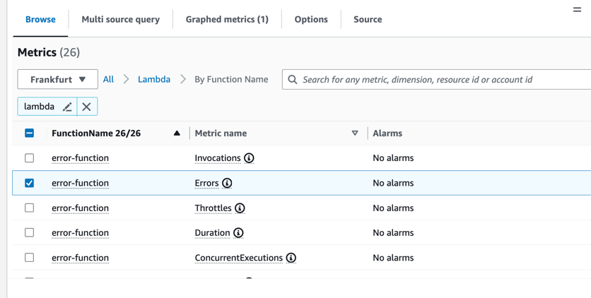
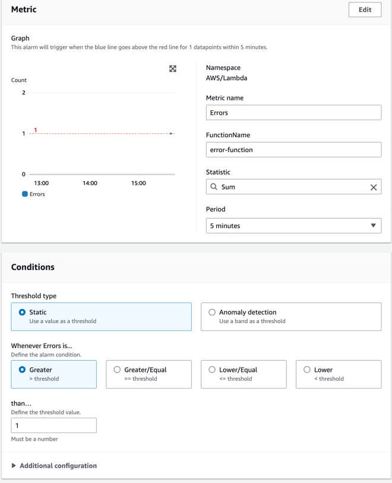
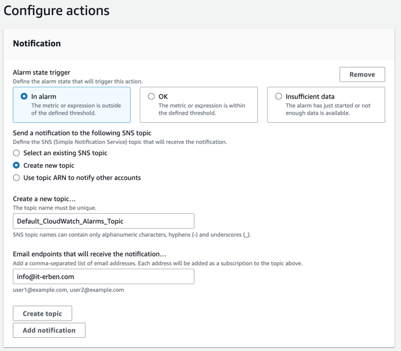

## Aufgabe 1: Dashboards

Legen Sie ein CloudWatch-Dashboard an mit allen relevanten Metriken über alle Lambda-Funktionen, die Sie in Ihrem Account deployt haben.
Wichtige Metriken sind: Invocations, Duration, Throttles und Errors

- Hierzu können Sie den Metrics-Explorer verwenden. Der Explorer hat ein Lambda-Template, das Sie links oben auswählen können.
- Um alle Funktionen anzuzeigen, wählen Sie unter "From" den Tag "FunctionName" mit "allValues" als Filter
- Sie können mittels "Add to dashboard" alle entstehenden Widgets einem neuen Dashboard hinzufügen.

## Aufgabe 2: Alerts

- Erstellen Sie eine neue Lambda-Funktion namens "error-function" mit node.js-Runtime. Belassen Sie den Standard-Source-Code, der hinterlegt wird
- Ersetzen Sie den Source-Code der Funktion durch den folgenden:

```javascript
export const handler = async (event) => {
  throw new Error();
  const response = {
    statusCode: 200,
    body: JSON.stringify('Hello from Lambda!'),
  };
  return response;
};
```
Denken Sie daran, den Deploy-Knopf zu drücken!

- Gehen Sie in die Alarms-Ansicht von CloudWatch und klicken Sie "Create Alarm"
- Klicken Sie auf "Select Metric"
- Suchen Sie nach "Lambda" und klicken Sie auf "By Function Name"
- Wählen Sie die "Error"-Metrik der Lambda-Funktion "error-function" und klicken Sie auf "Select Metric"



- Wählen Sie als Statistik "Sum" und als Threshold "Greater than 0"
- Die Alarmperiode sollte 1 Minute betragen. Je länger sie ist, desto länger müssen Sie auf einen Alarm warten.



- Als Alert Action, definieren Sie "In Alarm", "Create new topic" und geben Sie Ihre E-Mail-Adresse ein



- Schließen Sie den Wizard ab.
- Sie sollten nun bald eine E-Mail erhalten, in der AWS Sie auffordert, das Abonnement der SNS-Topic zu bestätigen. Warten Sie so lange und bestätigen Sie die E-Mail.
- Kehren Sie nun zur Lambda-Funktion zurück und klicken Sie auf den blauen "Test"-Knopf


Nach kurzer Zeit sollten Sie eine E-Mail erhalten.

