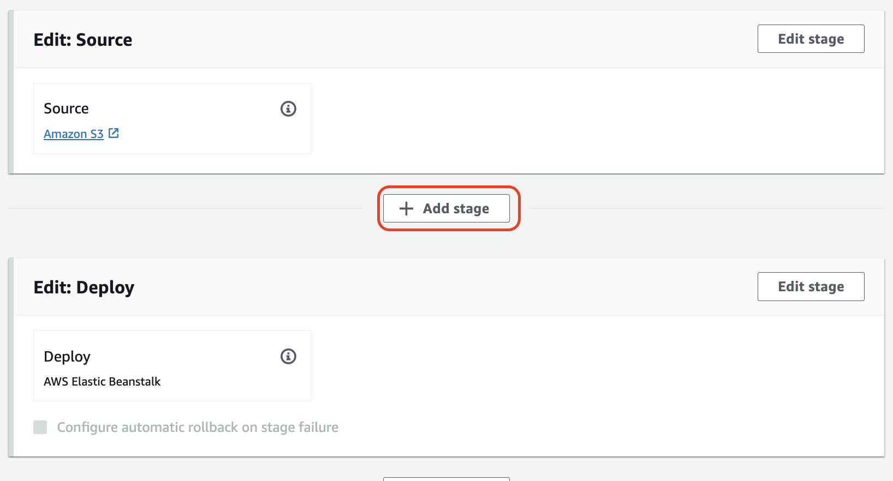

# Deployen in eine AWS Elastic Beanstalk-Anwendung

Für diese Aufgabe benötigten Sie eine laufende Elastic Beanstalk-Anwendung mit Plattform Python.
Wenn Sie die Aufgabe im [Beanstalk-Verzeichnis](../beanstalk) gemacht haben, ist eine solche Umgebung schon vorhanden.
Es empfiehlt sich dennoch, eine neue Anwendung anzulegen – alleine für die Übung.
- Die Anwendung können Sie beliebig benennen.
- Das Environment für die Anwendung sollte "production" heißen
- Wählen Sie als Tier "Web Server" und als Plattform des Environments "Python 3"
- Deployen Sie eine Sample Application, wenn Sie möchten, um zu testen, dass die Beanstalk-Umgebung erfolgreich angelegt wurde
- Warten Sie, bis der Aufbau abgeschlossen ist

## S3-Bucket für die Bereitstellung erstellen

- Erstellen Sie einen S3-Bucket zur Speicherung des Deployment-Codes über die S3-Konsole. 
- Achten Sie darauf, dass Versioning für den Bucket aktiv ist!

## Erstellen einer CodePipeline
 
- Öffnen Sie die CodePipeline-Konsole und wählen Sie "Create Pipeline".
- Geben Sie einen Namen für die Pipeline ein. 
- Lassen Sie alle sonstigen Einstellungen auf den Standardwerten und klicken Sie auf "Next"
- Fügen Sie eine Source-Stufe hinzu, wählen Sie Amazon S3 als Provider und geben Sie den S3-Bucket und den Objektschlüssel (app.zip) an.

- Für diese Pipeline benötigten Sie keine Build-Stufe. Überspringen Sie daher den Build-Schritt.
- Fügen Sie eine Deploy-Stufe hinzu:
    - Wählen Sie AWS Elastic Beanstalk als Provider.
    - Geben Sie die Namen der Beanstalk-Application und das Environment "production" an

- Überprüfen Sie die Einstellungen und erstellen Sie die Pipeline.
- Die Pipeline schlägt zunächst fehl, da sie app.zip noch nicht in S3 hochgeladen haben

## Testen der Pipeline

- Laden Sie die Datei "[app.zip](app/app.zip)" in den neuen Bucket hoch
- Die Pipeline wird automatisch ausgelöst und die Beanstalk-Anwendung wird bereitgestellt.
- In der Elastic Beanstalk-Konsole finden Sie die URL für das Environment, in das sie deployt haben. Rufen Sie sie auf und prüfen Sie das Ergebnis.

## Weiteres Environment und weitere Pipeline-Schritte hinzufügen 

- Fügen Sie Ihrer Elastic Beanstalk-Anwendung eine weitere Environment "Staging" hinzu mit den gleichen Einstellungen wie "Production". Dazu können Sie in der Übersicht des Environments unter "Actions" die Aktion "Clone Environment" wählen. 
- Gehen Sie in die Übersicht Ihrer Pipeline.
- Klicken Sie auf "Edit"
- Fügen Sie zwischen den Stages "Source" und "Deploy" eine neue Stage ein. Nennen Sie sie "Deploy-Staging"

- Fügen Sie der neuen Stage eine "Action Group" hinzu
- Vergeben Sie einen beliebigen Namen, wählen Sie als Provider "AWS Elastic Beanstalk"
- Input Artifacts muss "SourceArtifact" sein
- Geben Sie den Application Name Ihrer Beanstalk-Anwendung an
- Das Environment ist "Staging"
- Speichern Sie die Stage

- Fügen Sie nach der Deploy-Stage eine weitere Stage zu. Nennen Sie sie "Manual-Approval"
- Fügen Sie eine Action Group mit beliebigem Namen und Provider "Manual Approval" hinzu. Lassen Sie alle Optionen auf Default.
- Speichern Sie die Pipeline

## Testen der neuen Pipeline
 
- Klicken Sie auf "Release Change"
- Wählen Sie als Source Revision Override die neuste (und wahrscheinlich einzige) Revision
- Klicken Sie "Release" und warten Sie, dass die Pipeline bis zum manuellen Schritt läuft
- Klicken Sie nun auf den Button "Review" in der blau markierten Stage und bestätigen Sie das Review.
- Nun sollte die Produktiv-Umgebung deployt werden.

