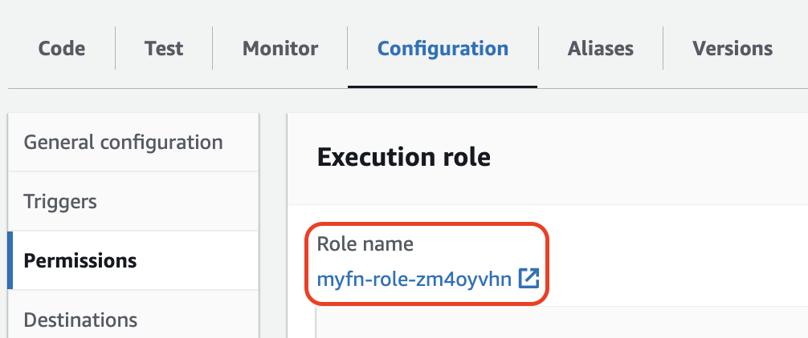
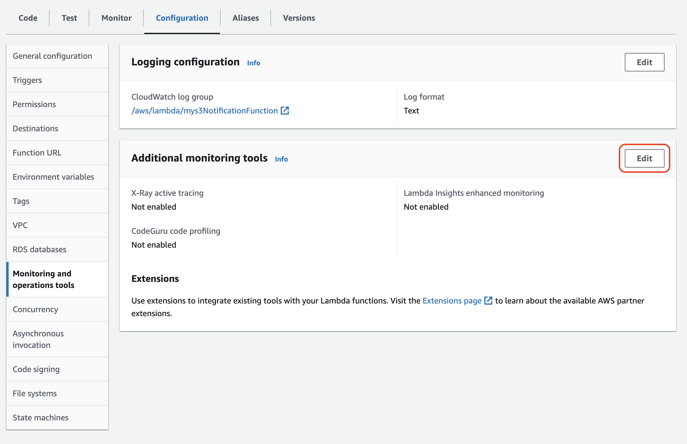
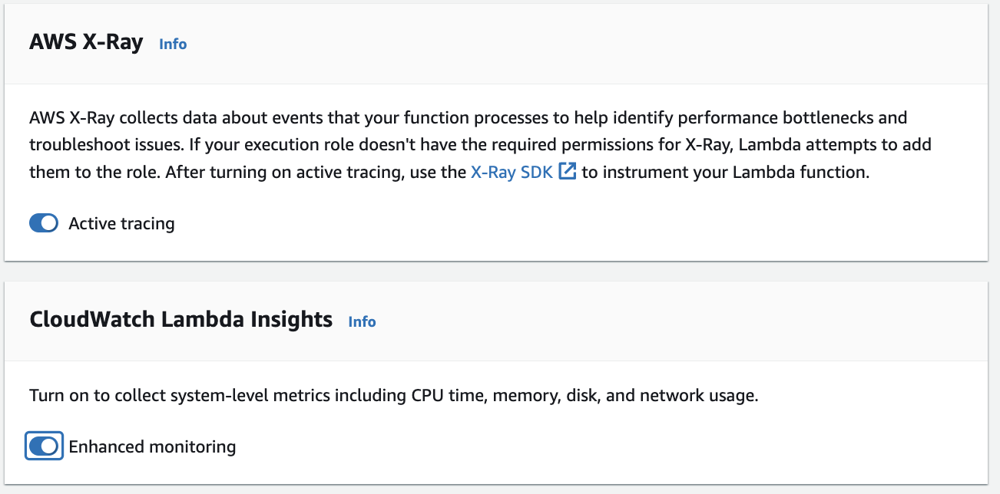
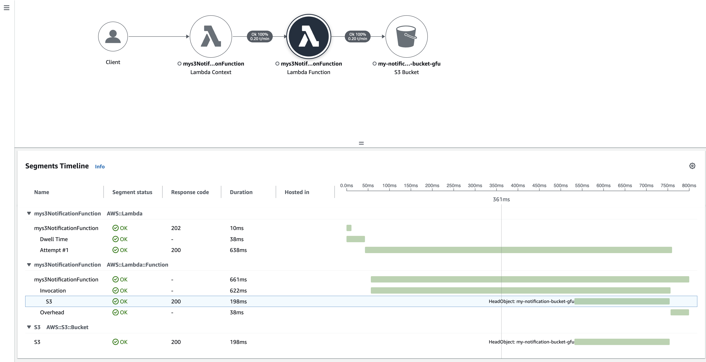

# Aufgabe 1: Erstellen und Auslösen einer AWS Lambda-Funktion durch ein S3-Ereignis

## S3-Bucket erstellen
- Gehen Sie zur S3-Konsole.
- Erstellen Sie einen neuen S3-Bucket mit beliebigem Namen

## Erstellen einer neuen Lambda-Funktion
- Melden Sie sich bei der AWS Management Console an und öffnen Sie den Lambda-Service.
- Klicken Sie auf "Create function".
- Wählen Sie "Author from scratch".
- Geben Sie der Funktion einen Namen, z.B. "S3EventFunction".
- Wählen Sie unter "Runtime" den Wert "Nodejs"
- Klicken Sie auf "Create Function"

## IAM-Rolle anpassen
- Wechseln Sie auf den "Configuration"-Tab.
- Wählen Sie den Reiter "Permissions" links aus.
- Klicken Sie auf den Link unter "Role Name", um die IAM-Konsole zu öffnen.

- Klicken Sie auf "Add Permissions -> Attach Policies".
- Wählen Sie "AmazonS3FullAccess" aus und klicken Sie auf "Add Permissions".

## Ereignisquelle hinzufügen
- Gehen Sie zum Abschnitt "Configuration" Ihrer Lambda-Funktion.
- Wählen Sie den Reiter "Triggers"
- Klicken Sie auf "Add trigger".
- Wählen Sie "S3" als Trigger-Typ.
- Wählen Sie den zuvor erstellten S3-Bucket aus.
- Wählen Sie "All object create events" als Ereignis-Typ.
- Klicken Sie auf "Add".

## Enhanced Monitoring aktivieren
- Gehen Sie in den Reiter "Configuration"
- Wählen Sie links "Monitoring and operation tools"
- Klicken Sie bei "Additional Monitoring Tools" auf "Edit"

- Aktivieren Sie Active Tracing und Enhanced Monitoring
- Klicken Sie auf "Save"

## Funktionscode anpassen
- Wechseln Sie zurück in die Lambda-Konsole Ihrer Funktion.
- Im Reiter "Code" laden Sie die Datei [app.zip](app/app.zip) hoch

## Test
- Laden Sie eine neue Datei in den S3-Bucket hoch.
- In der Lambda-Konsole wechseln Sie auf den Reiter "Monitor".
- Klicken Sie auf "View CloudWatch logs".
- Wählen Sie im "Log streams"-Bereich den neuesten (obersten) Log stream aus und prüfen Sie, ob ein Log für das Objekt erscheint.
- Gehen Sie nun wieder in die "Monitor"-Ansicht der Lambda-Funktion
- Klicken Sie auf "View X-Ray Traces"

Wir werden uns die Traces zusammen anschauen um zu verstehen, was sie bedeuten.

